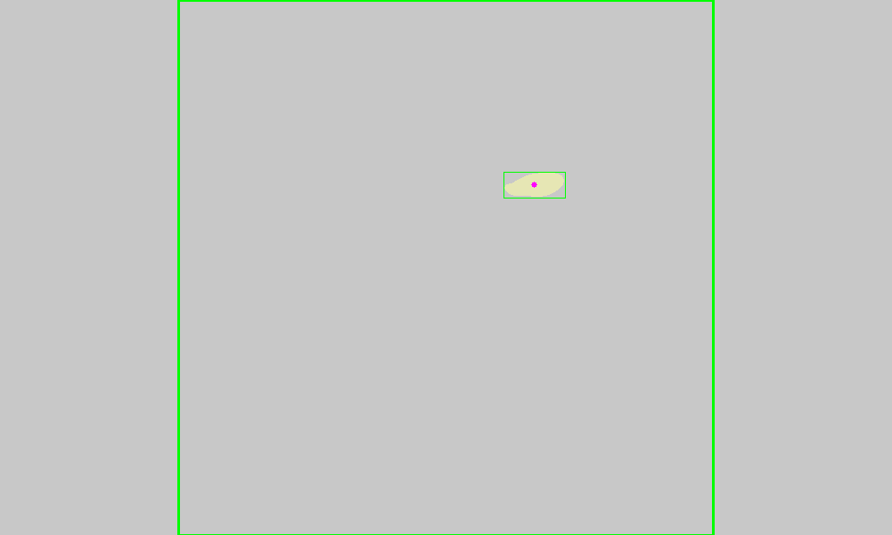
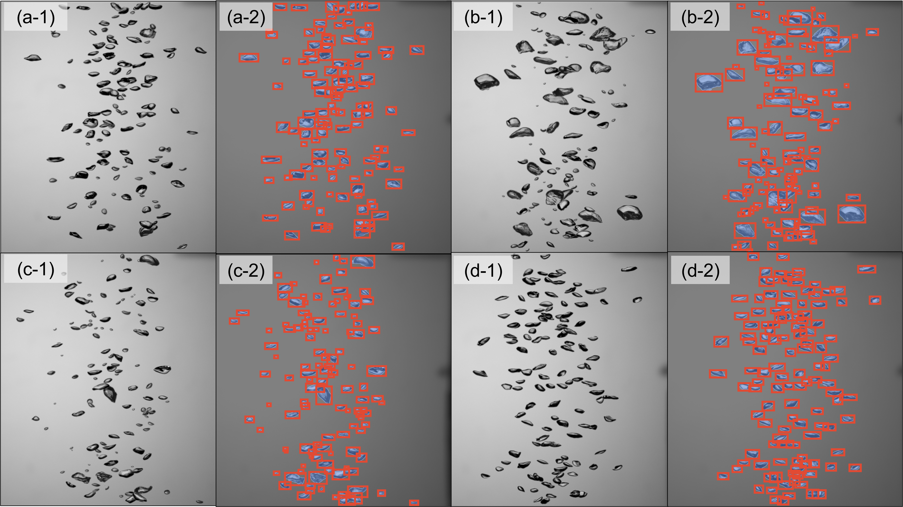
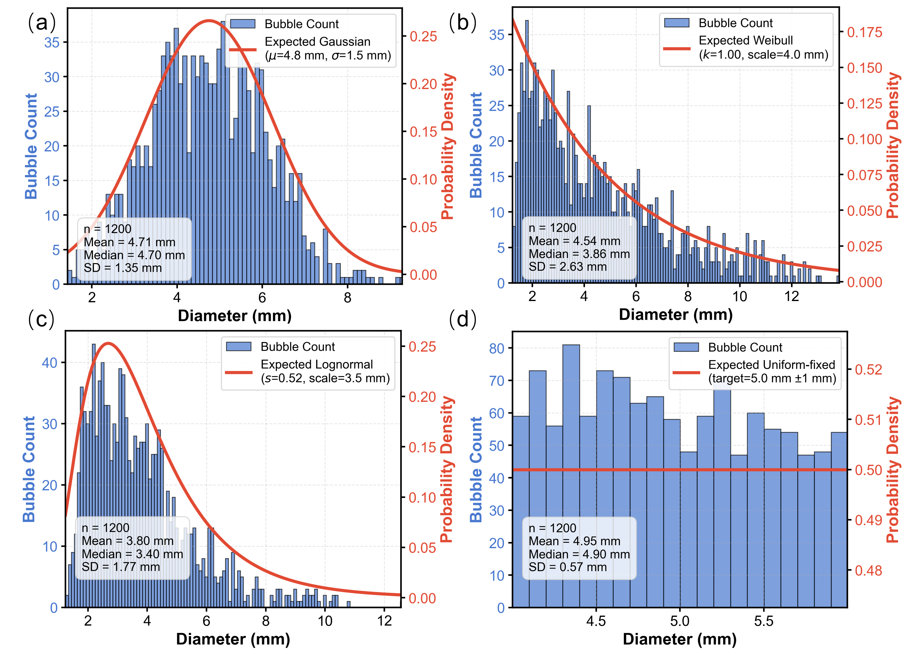
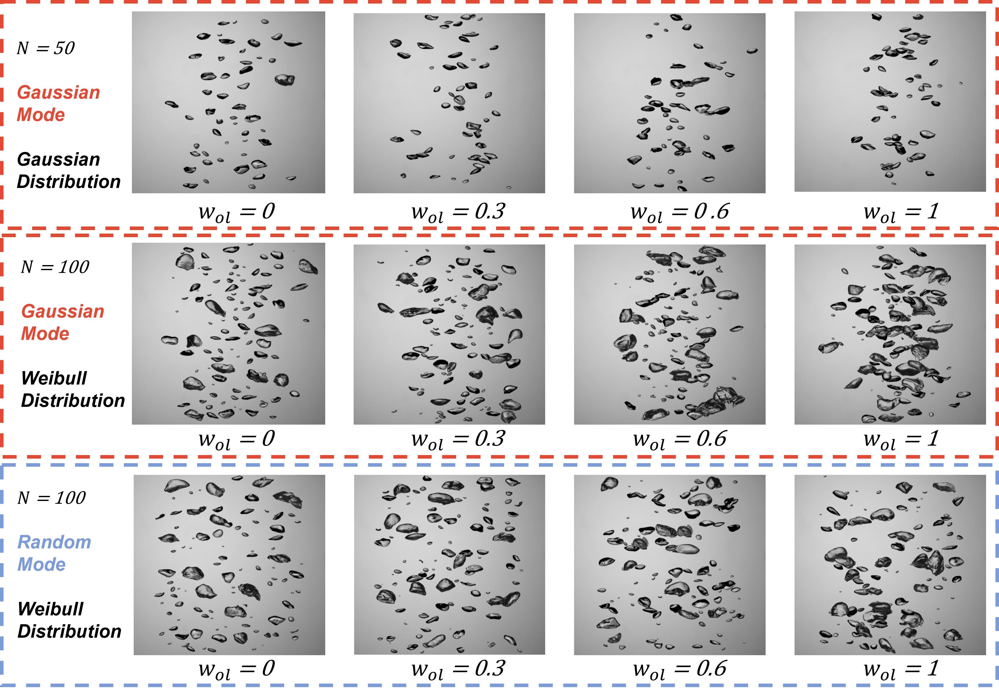

# PlumeDEBuG

[](https://www.python.org/)
[](LICENSE)

**Plume-Data Empowered Bubble-image Generator**

Synthetic bubble plume image generator that reproduces key physical characteristics of bubble plumes — including bubble size distributions, plume geometry, void fraction, and spatial overlap constraints.

<div align="center">
  
  <p><em>Environment Fluid Dynamics Lab</em></p>
</div>

---

## Demo

<div align="center">
  
  <p><em>Synthetic bubble plume generation</em></p>
</div>

---

## Key Features

- **End-to-end demo**: test a trained detection model on real experimental bubble plume data — [](https://colab.research.google.com/drive/1QHIMCuT1kbyJ0JEbh-Nj-KIkDQ_3L7Ql?usp=sharing)
- **Five bubble size distributions**: Gaussian, Lognormal, Weibull, Bimodal, Uniform
- **Trapezoid ROI plume model**: `W(y) = W₀ + 2ky` (Eq. 9)
- **Unidirectional overlap detection**: `R = A_int / A_exist > w_ol` (Eq. 6–7)
- **Quadtree spatial acceleration**: O(n log n) collision queries
- **Feathered compositing**: erosion + Gaussian blur + alpha blend (Eq. 12–18)
- **COCO-style JSON annotations** per image
- **K-S test** for distribution validation

---

## Quick Start

### Installation

```bash
git clone https://github.com/Schuetzen/PlumeDEBuG.git
cd PlumeDEBuG/Generator

# Option A: automated setup (Windows)
setup.bat

# Option B: manual
conda env create -f environment/environment.yml
conda activate PlumeDEBuG
```

### Generate images

```bash
cd Generator

# Edit config.ini, then:
python bubble_gen_public.py

# Visualize parameters (no real images generated)
python bubble_gen_illustration.py
```

Output is saved to `Generator/output/run<N>/` (auto-numbered).

### Dataset

Download the public bubble dataset from [Zenodo](https://zenodo.org/records/18793954) and place it under `dataset/`.

---

## Configuration (`config.ini`)

### General

```ini
[General]
num_synthetic_images = 100        ; Number of images to generate
max_bubbles_per_image = 200       ; Upper bound on bubbles per image
target_void_fraction = 0.15       ; Stop condition: halt when coverage reached (0–1)
```

### Placement

```ini
[Placement]
placement_mode = Gaussian         ; Gaussian | Random
overlap_control = 0.4             ; Max allowed occlusion ratio w_ol (Eq. 6-7)
use_trapezoid_roi = True          ; Enable plume growth model
entrainment_slope = 0.1           ; Plume growth rate k
base_width_ratio = 0.20           ; W₀ as fraction of canvas width
gaussian_scale_divisor = 4.0      ; Gaussian x-spread divisor σ_div
```

### Distribution

```ini
[Distribution]
distribution_type = lognormal     ; gaussian | lognormal | weibull | bimodal | uniform
selection_method = direct_pdf         ; direct_pdf (default) | weighted_sampling
```

Distribution-specific sections (only the active one is used):

```ini
[Gaussian]
mu = 0.002          ; Mean diameter (m)
sigma = 0.002       ; Std deviation (m)

[Lognormal]
lognormal_mu = -5.8         ; Log-mean μ_ln
lognormal_sigma = 0.5       ; Log-std σ_ln

[Weibull]
weibull_shape = 1.0         ; Shape k
weibull_scale = 0.004       ; Scale λ (m)

[Bimodal]
mu1 = 0.002    sigma1 = 0.0005    ; Mode 1 (m)
mu2 = 0.005    sigma2 = 0.001     ; Mode 2 (m)
weight1 = 0.6                     ; Mode 1 mixing weight

[Uniform]
r0 = 0.003          ; Central diameter (m)
delta = 0.001       ; Half-range (m), f(r) = 1/(2δ) on [r₀−δ, r₀+δ]
```

### Experimental features (disabled by default)

| Section | Description |
|---|---|
| `[Experimental_MixedMode]` | Randomize parameters every 10% of images |
| `[Experimental_VelocityBias]` | Size-velocity coupling (large bubbles near plume center) |
| `[Experimental_CumulativeOverlap]` | Cumulative overlap threshold in addition to per-bubble check |

---

## Selection Methods

| Method | Description |
|---|---|
| `direct_pdf` | Samples bins according to target PDF only, ignoring how many real bubbles exist per bin. **Default.** |
| `weighted_sampling` | Multiplies target PDF weight by bin sample count — balances distribution fidelity with data availability. |

---

## Project Structure

```
PlumeDEBuG/
├── Generator/
│   ├── bubble_gen_public.py        Main image generator (v5.0, paper-aligned)
│   ├── bubble_gen_illustration.py  Parameter visualizer (matplotlib simulation only)
│   ├── config.ini                  All parameters
│   ├── visualize_simple.py         Quick output viewer
│   ├── setup.bat                   Windows environment setup
│   ├── environment/
│   │   ├── environment.yml
│   │   └── requirements.txt
│   ├── assets/                     Demo images and logos
│   ├── output/                     Generated runs (auto-numbered)
│   │   └── run<N>/
│   │       ├── synth_XXXX.png      Synthetic image
│   │       ├── synth_XXXX.json     COCO-style annotation
│   │       ├── execution_log.txt
│   │       ├── config.ini          Config snapshot for this run
│   │       ├── roi_visualization.png
│   │       └── bubble_diameter_histogram.png
│   └── parameter_illustrations/    Output of bubble_gen_illustration.py
│       ├── unified_parameter_diagram.png/pdf
│       └── distribution_comparison.png/pdf
├── dataset/                        Raw bubble image datasets
│   ├── <folder>/
│   │   ├── Dataset/Cropped/
│   │   ├── Dataset/Masks/
│   │   └── aggregated_results.mat
│   ├── background_tank.tif
│   └── DataInfo.txt
├── Aggregated_bubble_data/
│   ├── aggregated_results.mat      Merged dataset
│   └── aggregated_results.db       SQLite database (used by generator)
├── trained_model/
│   ├── yolov11/                    YOLOv11 bubble detection weights
│   └── SAM/                        SAM segmentation checkpoint
├── tools/                          Dataset preprocessing (MATLAB + Python)
└── ReadMe.md
```

---

## Complete Workflow

```
New Images → Validate → Compute Metrics → Merge → Balance → SQLite → Generate
  (Step 1)    (Step 2)     (Step 3)      (Step 4)  (Step 5)  (Step 6)   (Step 7)
```

### Step 1 — Add new images

Required folder structure:

```
dataset/<name>/
├── Dataset/
│   ├── Cropped/   <prefix>_cropped.tif
│   └── Masks/     <prefix>_mask.tif
└── aggregated_results.mat
```

Create the `.mat` file in MATLAB:

```matlab
imgInfo(1).imageName = 'bubble001';       % No extension
imgInfo(1).bubble_diameter = 0.0035;      % Diameter in meters

save('dataset/<name>/aggregated_results.mat', 'imgInfo');
```

Required fields: `imageName`, `bubble_diameter` (meters).

### Step 2 — Validate

```matlab
cd tools
% Set baseFolder = '../dataset/<name>' in each script:
check_file_correspondence   % Verify 1-to-1 crop/mask/mat correspondence
sync_database               % Remove orphaned files
```

### Step 3 — Compute bubble metrics

```matlab
% Add folder name to sourceDirs in compute_ellipse_fits.m:
compute_ellipse_fits
```

### Step 4 — Merge datasets

```matlab
% Edit sourceDirs list in combine_datasets.m:
combine_datasets
% Output: ../Aggregated_bubble_data/aggregated_results.mat
```

### Step 5 — Balance distribution (optional)

```matlab
filter_size_bins    % Reduce over-represented size bins
plot_distribution   % Visualize result
```

### Step 6 — Convert to SQLite

```bash
cd tools
python mat_to_sqlite.py
# Input:  ../Aggregated_bubble_data/aggregated_results.mat
# Output: ../Aggregated_bubble_data/aggregated_results.db
```

### Step 7 — Generate images

```bash
cd Generator
# Verify [Database] paths in config.ini, then:
python bubble_gen_public.py
```

---

## Database Tools Reference

| Tool | Language | Purpose |
|---|---|---|
| `mat_to_sqlite.py` | Python | Convert `.mat` → SQLite (supports v7 and v7.3) |
| `combine_datasets.m` | MATLAB | Merge multiple dataset folders into one `.mat` |
| `sync_database.m` | MATLAB | Synchronize `.mat`, `Cropped/`, `Masks/` (remove orphans) |
| `check_file_correspondence.m` | MATLAB | Verify 1-to-1 correspondence across all three sources |
| `clean_orphaned_files.m` | MATLAB | Delete files not referenced in `.mat` |
| `clean_empty_rows.m` | MATLAB | Remove empty rows from `.mat` |
| `balance_crops.m` | MATLAB | Remove masks without matching crops |
| `balance_masks.m` | MATLAB | Remove crops without matching masks |
| `filter_size_bins.m` | MATLAB | Proportionally reduce counts in specified diameter bins |
| `compute_ellipse_fits.m` | MATLAB | Batch compute ellipse fits for all masks |
| `plot_distribution.m` | MATLAB | Plot bubble diameter histogram |

---

## Example Output

<div align="center">
  
  <p><em>Synthetic image with bounding box annotations</em></p>
</div>

<div align="center">
  
  <p><em>Generated bubble diameter distribution vs. target</em></p>
</div>

<div align="center">
  
  <p><em>Gaussian vs. Random placement modes</em></p>
</div>

---

## Troubleshooting

| Problem | Solution |
|---|---|
| `imgInfo variable not found` | Ensure `.mat` file contains `imgInfo` struct (not `data` or other names) |
| `Cropped/Mask file mismatch` | Run `sync_database.m` |
| `Target bubble count not reached` | Increase `overlap_control`, decrease `base_width_ratio`, or reduce `max_bubbles_per_image` |
| `K-S test p-value too low` | Use `filter_size_bins.m` or switch to `direct_pdf` selection method |
| MATLAB `.mat` version error | `mat_to_sqlite.py` handles both v7 and v7.3 automatically |

---

## Contributing

1. Fork the repository
2. Create a feature branch: `git checkout -b feature/name`
3. Commit: `git commit -m 'Add feature'`
4. Push: `git push origin feature/name`
5. Open a Pull Request

---

## License

MIT License — see [LICENSE](LICENSE) for details.

---

## Contact

**Xuchen (Schuetzen) Ying** — xuchen.ying@mail.missouri.edu
**Dr. Binbin Wang** — wangbinb@umsystem.edu
Project: https://github.com/Schuetzen/PlumeDEBuG

---

*Tooling assisted by [Claude Code](https://claude.ai/) (Anthropic)*
